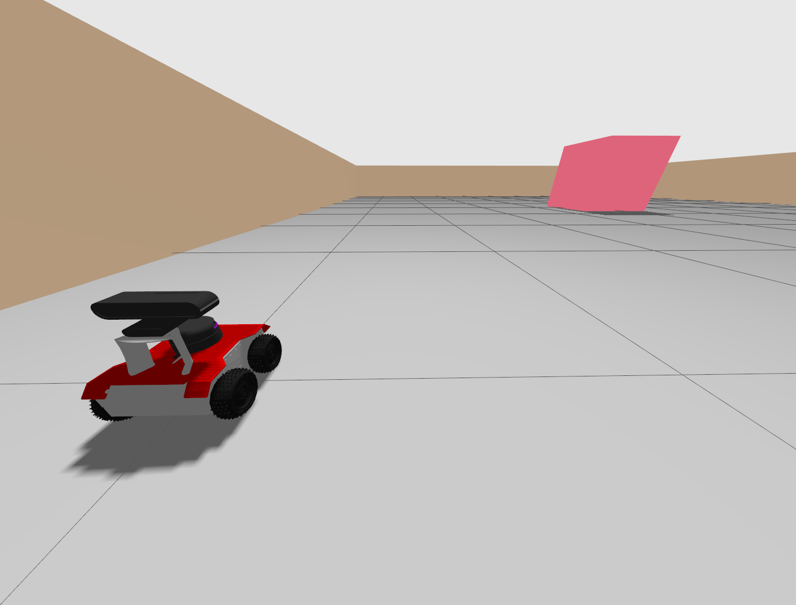

# Data-Driven Safe Motion Planning for Nonlinear Systems

Repository for the paper:
**“Data-Driven Motion Planning with Safety Guarantees for Nonlinear Systems”**  

> **Repository under construction** – code, demos and documentation are being prepared.  
> Check back soon for simulation scripts, example walkthroughs and usage instructions.

## 📸 Visuals

<!-- Single image: path tracking -->

  
   
  <em>Planned dynamics-aware safe path for an autonomous vehicle.</em>

<!-- 1 × 2 subplot -->
<table align="center">
  <tr>
    <td></td>
    <td></td>
  </tr>
</table>

<em>Gazebo environment for the Rosbot 2R.</em>

---
